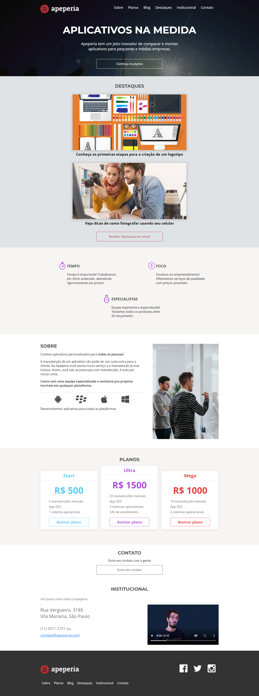

<h1 align="center" id="top">Apeperia</h1>

<h2>Sobre </h2>

  Landing page desenvolvida para vender serviços de criação e manutenção de apps.

<h2>Tecnologias e ferramentas</h2>

Foram utilizadas no projeto as seguintes tecnologias e ferramentas:

* HTML
* CSS

<h2>O que aprendi com esse projeto</h2>

* Processo de desenvolvimento de páginas web com conceito Mobile First.
* Emmet, ferramenta para agilizar a escrita de códigos.
* Manutenção de códigos com variáveis CSS.
* Escrever códigos semânticos que ajudam na acessibilidade e SEO.
* Adaptação de diferentes layouts com conhecimento de RESPONSIVIDADE.
 
 <h2>Versão para Desktop</h2>
 

 <h2>Versão Mobile</h2>

