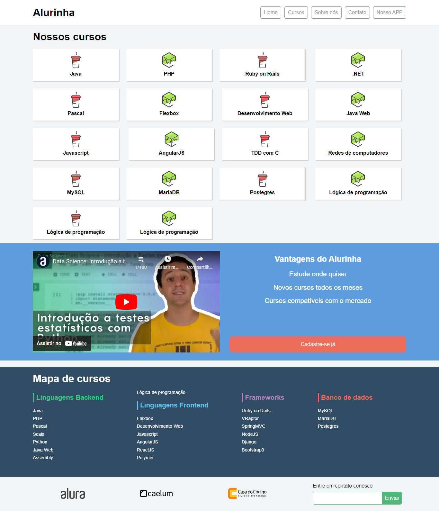
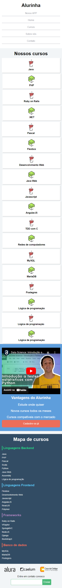

<h1 align="center" id="top">Alurinha</h1>

<h2>Sobre </h2>

  Landing page desenvolvida para mostrar os cursos da Alura.

<h2>Tecnologias e ferramentas</h2>

Foram utilizadas no projeto as seguintes tecnologias e ferramentas:

* HTML
* CSS
* Flexbox
 
 <h2>Versão para Desktop</h2>
 

 <h2>Versão Mobile</h2>

